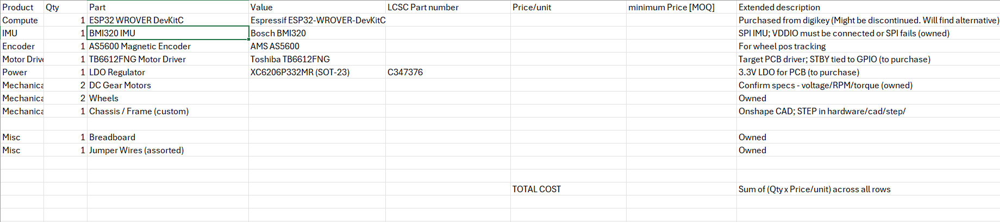
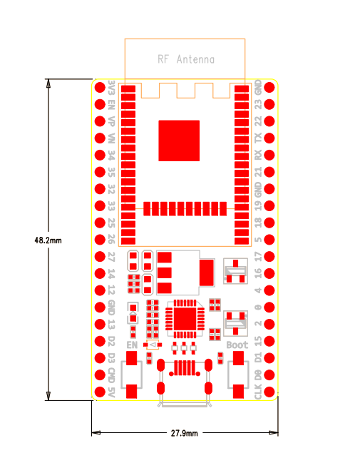
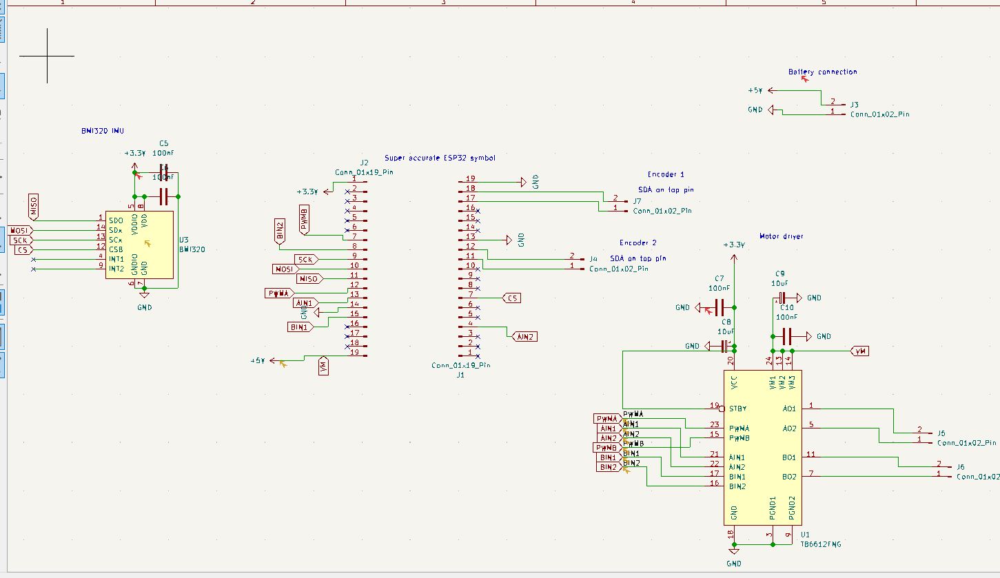
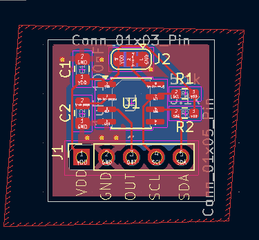
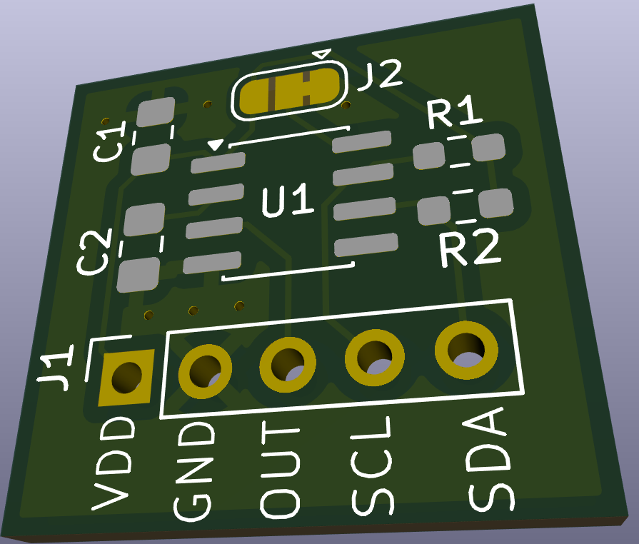
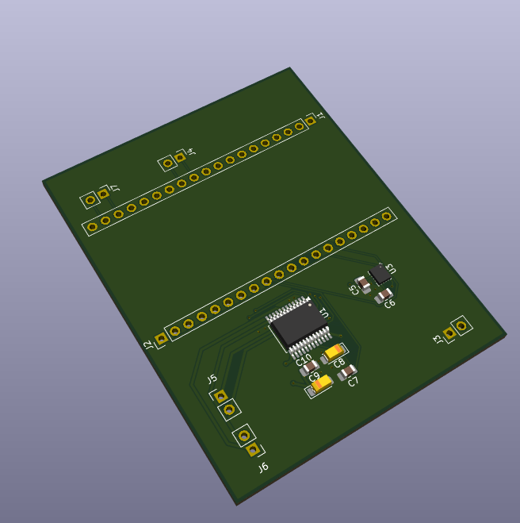
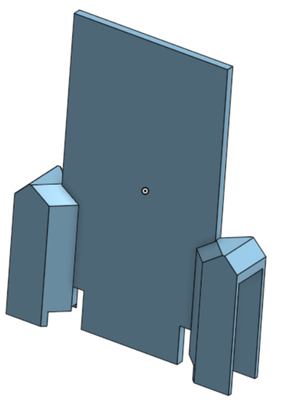
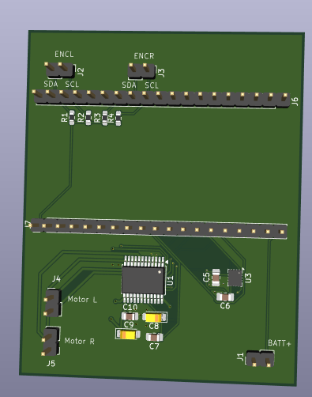

# Before logging began: Initial concept and first assembly

Built the initial concept with basic IMU-to-motor response firmware
(no PID, no testing chassis yet). Hit the first major bug: the ESP32
boot-looped due to noise on boot GPIO pin 14 — solved by migrating
motor control to pin 25. Iterated quickly on a testing chassis design
in Onshape, then completed the first full assembly of the robot.

**Total time spent: 8 hours**

# June 10: First balancing test, MPU6050 signal dropouts

Goal: gather initial test results before upgrading to more reliable hardware.

Ran the first balancing test and tried to tune PID. The MPU6050
sensor signal repeatedly cut out, causing laggy, intermittent motor
response. Impossible to tune or balance as a result.

Suspected cause: the current breadboard prototype and jumper wire
connections are introducing mechanical and electrical noise, causing
signal drops.

Next step: design and order a BMI320 breakout board and solder
connections to the ESP32 to eliminate testing noise.

**Total time spent: 2 hours**

# June 14: Noise mitigation on the current setup

Goal: investigate what can be done to minimize noise with the
current setup, with intent to carry the findings into the future
design even after the hardware changes.

- Twisted signal wires with GND to reduce noise
- Tuned the complementary filter to smooth the angle estimate

Both changes lowered high-frequency noise and smoothed robot motion.
Signal dropouts still persist, further supporting the need for a
custom PCB.

before:

after:

**Total time spent: 1 hour**

# June 20: Chasing a software cause for signal dropout

Goal: investigate potential software causes for signal dropout.

- Disabled the motors
- Printed IMU readings to the serial console for debugging
- Discovered occasional watchdog timer triggers
- Added a delay to the control loop

The added delay *significantly* reduced signal dropouts during
balancing, making tuning noticeably easier. Dropouts still occur
sparsely but are much more under control now, allowing balancing
attempts to come much closer to succeeding.

**Total time spent: 2 hours**

# July 19: Custom BMI320 driver and board complete, PCB subsystems in design

BMI320 board debugging is complete and fully functioning. Root cause
was a disconnected VDDIO pin, which prevented the chip from powering
up properly. BMI320 driver firmware is nearing completion and cleanup.

PCB subsystem test boards are now in design (MCU, motor driver,
encoders). Encoders will be used to implement full 4-state LQR control.

Next: reach a fully functioning, fully integrated PCB and begin LQR
implementation.

LQR is short for Linear Quadratic Regulator and is the industry standard for optimal control in state space systems.

Credit to this paper from MIT that helped me learn it:
https://underactuated.mit.edu/lqr.html

**Total time spent: 4 hours**

# Aug 13: PCB subsystems combined into one schematic, Final PCB in design

Combined PCB subsystems into one schematic. Had to resolve a few pin conflicts

BMI320 IMU

Motor driver

Will move on to finalizing and reviweing connections. The start routing the final PCB.
Next steps will be to also finalize magnetic rotary encoder PCB and implement a cad mounting solution. To actually enable Full 4 state LQR control. I have high hpes for the stability of the final robot. Should be significantly more effective than PID.

**Total time spent: 1 hours**

# Aug 16: Putting together a tentative BOM, finalizing schematic, and going down the LQR rabbit hole

While the project is still in progress and not all parts are finalized, I still chose to put together a rough BOM to start to have an idea of what is pending and what can move forward.

Was a pain but I found the exact model of the esp32 board I used without even having it on me (Im on vacation) for the PCB. Also has been added to BOM

With this newfound knowledge, I started finalising the Schematic now that parts are confirmed (just not passive components yet). Super messy rign now will make sure to do LOTS of double checking because I rlly want this to work first try or I might not finish the project in time.

Finalized the schematic!

Still needs to be revieved and double checked but should be moving on the layout in a day or 2.

Also finished encoder PCB design.

Started working on LQR formulas derivation and simulation. Lots of juicy high level math.

The first thing I did was put together what essentially is a simplified writeup covering how LQR will be implmented specifically in my project. There is a lot I don't yet know so expect updates as I learn more about LQR.

To see my writeup about the math behind LQR, go to docs/LQR.md

**Total time spent: 5 hours**

# Aug 17: PCB layout and Started V2 CAD Model

Heres the Layout for the final PCB. Have not reviewed or added silkscreen touchups yet.

Also started designing a sleeker cad model designed to hould the PCB, motors, and battery.
I had to do this without having any of the parts on hand so I also had to spend some time looking online for part dimensions. 

Im trying to design the PCB and CAD in paralel to make sure the overall robot is as well put together as possible.

**Total timespent: 2 hours**

# Aug 18: Finalized the PCB!

After triple checking the schematic I polished and cleaned up the PCB layout and it is now ready to order.

I think it looks great!

Im planning to order it in black to lean into the liquorice theme. Maybe I'll print it with red accents as well I feel like that could look really cool.

I also spent some time working on my readme and BOM to make sure it meets the review requirments.

The BOM only is missing passive components now which will be added soon as I already have them added to my LCSC cart.

Next I need to review the encoder PCB and finally order everything.

**Total timespent: 1 hours**