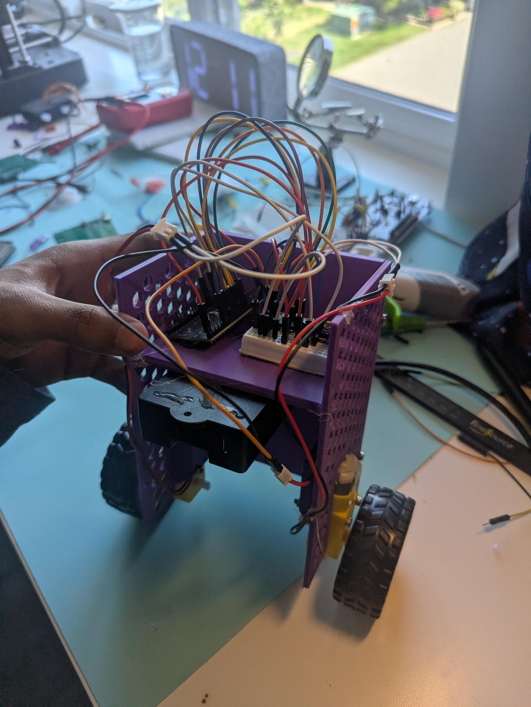
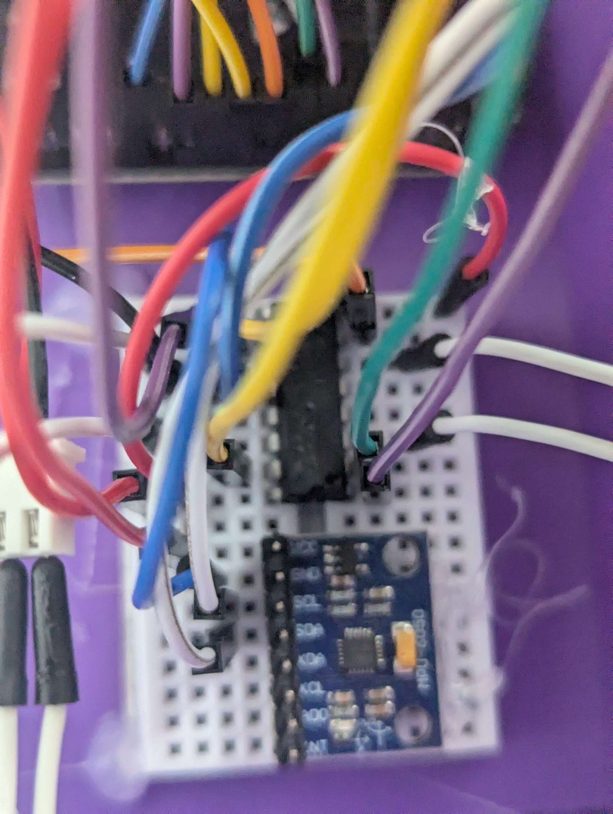
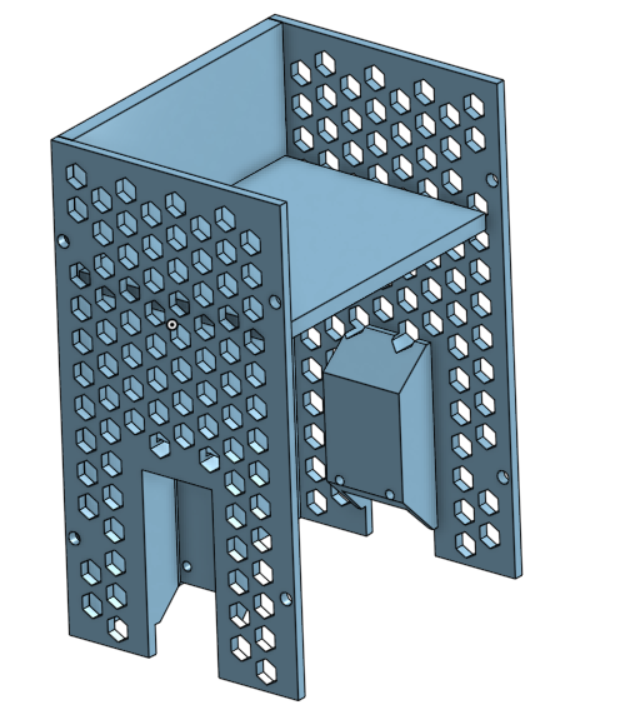
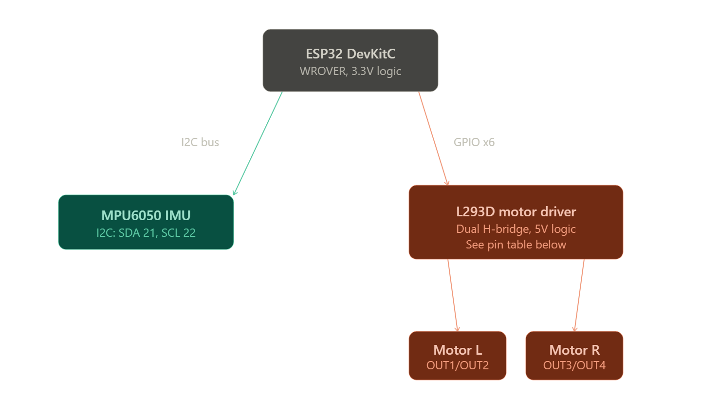
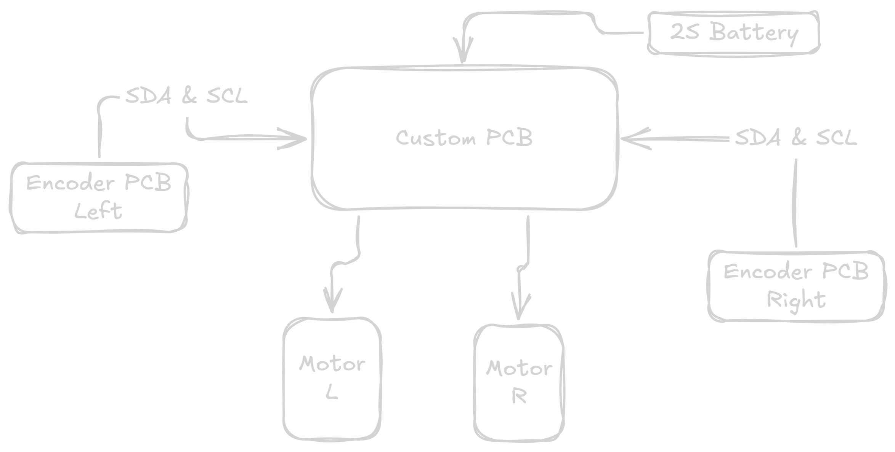

# StabilityBot MK1

*Currently in prototype phase*

A self-balancing two-wheeled robot — an inverted pendulum stabilized
by IMU feedback and PID motor control, being built up toward full
4-state LQR control on a custom PCB.

**Full write-up / showcase:**
[sohumnigam.github.io/projects/stability_bot_MK1.html](https://sohumnigam.github.io/projects/stability_bot_MK1.html)

## Why I built this

I wanted a project that went past the usual "balance a robot with a
PID loop" hobby build — something that let me go deep on control
theory (state-space modeling, LQR, Kalman filtering), embedded
firmware, and PCB design all at once, and end up with a portfolio
piece that shows that depth rather than just a demo video. The
long-term goal is a robot that balances using a full 4-state LQR
controller (θ, θ̇, x, ẋ) on hardware I designed myself, with a
classical-vs-learned comparison against a reinforcement learning
controller down the line.

## Photos

## Demo Video

This version used PID to validate the hardware setup and learn about basic control theory. 

Will implement LQR in the future.

## Current Wiring Diagram (Subject to change)

## Future Diagram

## Current Features

- Active motor balancing response
- IMU sensor fusion (complementary filter, Kalman filter in progress)
- PID control loop
- Live web dashboard (WebSocket telemetry: pitch, motor output, PID
  tuning sliders) served from the ESP32 in SoftAP mode

## Hardware Overview

| Component | Current | Planned Upgrade |
|---|---|---|
| Compute | ESP32 Devboard | - |
| IMU | MPU6050 | Bosch BMI320 (SPI) |
| Motor driver | L293D | TB6612FNG |
| Motors | Standard yellow DC geared motors | — |
| Battery | ELEGOO battery pack | Will be compatible with any 2s Battery |
| Chassis | 3D printed | — |
| Encoders | None | AS5600 |

## Software Overview

**FreeRTOS control task**
- IMU readings
- PID calculations (LQR planned once encoders are integrated)
- Motor PWM control

**FreeRTOS web interface task**
- Digital logging
- Mobile control
- Remote PID tuning

## How to Assemble

<!-- TODO: fill in with real steps once chassis/wiring is finalized -->
1. 3D print the chassis (files: hardware/cad/step)
2. Mount motors and wheels using the screws that come with the yellow motors
3. Wire IMU, motor driver, and battery to the ESP32 per the defined pins in main.c (you will need to look in the motor structs for them)
4. Secure battery pack and IMU to minimize vibration noise. I used hot glue for this version.

## How to Flash

1. Clone this repo into your ESP-IDF project directory
2. Confirm your wiring matches the pin assignments in `main/`
3. Build and flash with `idf.py build flash monitor`
4. Connect to the robot's WebSocket dashboard to tune PID live

## Rough Bill of Materials

See the full BOM in BOM.csv. Still a work in progress as some passive parts are not yet finalized.

| Category | Qty | Part | Value | LCSC Part # | Price/unit | Extended Description | Link |
|---|---|---|---|---|---|---|---|
| Compute | 1 | ESP32 WROVER DevKitC | Espressif ESP32-WROVER-DevKitC | $11.99 | — | Purchased from DigiKey | [DigiKey](https://www.digikey.com/en/products/detail/espressif-systems/ESP32-DEVKITC-VIE/12091811) |
| IMU | 1 | BMI320 IMU | Bosch BMI320 | C22391148 | $0.99 | SPI IMU | [LCSC](https://www.lcsc.com/product-detail/C22391148.html) |
| Mechanics | 2 | Diametric Magnets | — | — | — | Will try to find (Hard to find affordable sources) | [Amazon](https://www.amazon.com/Diametrically-Magnetized-Neodymium-Permanent-Magnet/dp/B0GWXBS6SM) |
| Encoder | 1 | AS5600 Magnetic Encoder | AMS AS5600 | C499458 | $1.1855 | For wheel position tracking | [LCSC](https://www.lcsc.com/product-detail/C499458.html) |
| Motor Driver | 1 | TB6612FNG Motor Driver | Toshiba TB6612FNG | C141517 | $1.1659 | Target PCB driver; STBY tied to GPIO | [LCSC](https://www.lcsc.com/product-detail/C141517.html) |
| Mechanical | 2 | DC Gear Motors | — | — | — | Includes wheels | [Amazon](https://www.amazon.ca/SazkJere-Geared-Motor-Gearbox-200RPM/dp/B0G64KFYPS) |
| Mechanical | 1 | Chassis / Frame (custom) | — | — | — | Onshape CAD; STEP in `hardware/cad/step/` | — |

**Total cost:** *TBD — ESP32, magnets, gear motors, and chassis are missing per-unit pricing.* Known subtotal (BMI320 + AS5600 + TB6612FNG, qty 1 each): **$3.34**
## Known Issues

- IMU signal occasionally drops out on the current breadboard
  prototype — traced to noise from jumper wire connections; largely
  mitigated with twisted GND pairs and a control-loop delay, but not
  fully eliminated. Root fix is the move to a soldered BMI320 board
  and eventually the custom PCB.
- 4-state LQR not yet running on hardware — pending encoder
  integration.

## Credits

- Built on [ESP-IDF](https://github.com/espressif/esp-idf) (Espressif)